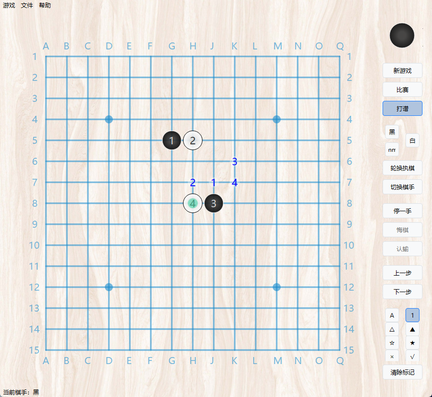

## 程序简介

​       本程序是一个通用类的棋类游戏打谱程序，使用python开发（后版本为c++），ui界面为pyside6。

## 设计资料参考

​         本人使用程序演示的棋类游戏案例均来自于互联网，在演示中仅包含两种内容：规则演示和对局演示，故演示内容本人不保留任何知识产权，演示资料亦均未获取知识产权。

​         对于一些常见的游戏，如围棋、五子棋等，本人会收集网络上的公开资料，一般不说明出处，对于一些民间棋类游戏，本人会参考部分书籍，亦不说明出处，对于一些个人设计的新棋，若查明游戏出去，本人会展示其信息。

## 程序基本功能

​         程序运行后为一个启动器窗口，可以选择想要演示的棋类游戏程序，启动后会进入游戏界面，左侧为棋盘，右侧为工具，界面简单。在菜单栏，使用者可以切换游戏、保存棋局。

​          程序的设计结构简单，app由ui和rule组成。ui采用pyside自作，仅能绘制棋盘、加载图片、绘制棋子。rule程序主要由一个matrix组成，用矩阵的形式显示棋盘格点和棋子坐标的对应关系，矩阵每个点位的值为一个整数，-128标识无效点位，0表示空点，其余自定义值为棋子，通常用1表示黑棋，用2表示白棋。matrix有一个region、neighbortable、movedest三大参数，分别表示棋盘的有效区域、格点的连线关系（包括明线和暗线）、棋子的移动规则。

​           程序的基本方法有10个，采用2维组合的形式，棋手点击棋盘时，会将棋手上一步的操作和本步操作进行组合，如前一步点击己方棋子，本步点击空格，则为移动，前一步点击己方棋子，本步点击对手棋子，则为移动击杀，总共3*3为九种情况，加上pass为为特殊一手，共计10个，其中有效的约一半。此外还有部分按钮，不属于基本行棋规则。各个棋类游戏的具体实现，均依托于这些基本方法。

## 关于本仓库

- 本仓库的主源码在[boardgame ](boardgame/) 文件夹内，这个源码完全由python开发完成，但部分功能没有实现，也未通过测试。

- 一个成熟的案例在[example](example/) 内，一共实现了约57种简单的棋类游戏，但它部分是使用c++重构的，这里只有c++编译的pyd文件。你可以点击run.exe文件直接运行程序。

## 启动程序

1. 点击run.exe或运行main.py可以打开启动器，选择游戏后，点击开始游戏可以运行游戏。

2. 游戏菜单内可以重新开始游戏、切换其他游戏、退出游戏。

3. 文件菜单可以保存棋谱和导出棋谱。只有[example](example/) 完整实现了历史记录功能。
4. 比赛模式可以像对战一样模拟行棋（但只有一个玩家），会自动切换棋手，游戏结束后不可再行棋。

5. 打谱模式可以切换棋手、自由落子、手动回溯历史记录、进行点位标记。

## 游戏示意

#### 1、普通五子棋

​        五子棋可能是流传度最高的棋类游戏了，其**普通规则**特别简单，即在15*15的棋盘上，黑白双方轮流落子，先完成五子连珠的一方获胜。在《中国五子棋竞赛规则》中，五子棋的**比赛规则**主要分为指定开局、自由开局两种，涉及到三手交换、五手N打、黑棋禁手等规则的组合。由于比赛规则较为严谨，本演示仅做普通规则演示。

#### 2、井字棋

井字棋是连三获胜的五子棋。

#### 3、六消井字棋

六消井字棋在原有井字棋的模式下做了改良，从第六子开始会逐渐消除前面的第一子，称为六消机制。

#### 4、六连棋

六连棋是五子棋的变体游戏。与五子棋（普通）有以下不同：

- 使用19x19棋盘，落子于交叉点。

- 开局黑可落一子，之后每回合双方各连下2子，交替下子。
- 任一方连六胜利。

#### 5、反五子棋

作者：日出、夏日

反五子棋是五子棋的变体游戏。与五子棋（普通）有以下不同：

- 任一手棋，可以选择落子在空白点位，或者选择落子到棋盘对手棋子的位置，并以占位的方式移动（挪动）对手棋子。
- 移子：以占位的方式挪动对方棋子时，挪动的终点为起点八个方向的直线上的一点，且和起点之间无任何其他棋子阻挡，其距离不限。
- 输赢规则：任一手后，若棋盘上横竖倾斜四个方向有形成至少5颗棋子连成一行的情况，则形成五子连珠的棋子颜色的一方判负，棋局结束。

#### 6、斜胜棋

斜胜棋是民间游戏，和五子棋规则相似，其规则如下：

- 斜胜棋采用5x5棋盘，棋子位于方格内部。
- 斜胜棋分为黑白两子，数量各5枚。
- 规则：
    - 对局双方各执一色棋子。
    - 开局时，双方5枚棋子分别位于距自己最近的一线5个格子内。
    - 黑先、白后，交替移动棋子，每次只能移动一子。
    - 移动棋子棋子的方式为横或竖任意一步。
    - 移动到对手棋子位置时，以占位的方式吃掉对方一子。
- 出现以下情况获胜：
    - 有5枚棋子时，5子斜向五连获胜；
    - 有4枚棋子时，4子斜向顶边四连获胜；
    - 有3枚棋子时，3子斜向顶边三连获胜；
    - 有2枚棋子时，2子斜向顶边二连获胜；
    - 仅剩1枚棋子时，占据棋盘任意一个角格获胜；
    - 吃光对手棋子获胜。

#### 7、重力四子棋

重力四子棋是五子棋的衍生游戏。与五子棋（普通）有以下不同：

- 采用6x7棋盘，落子于格子内。
- 落子后，棋子会受重力向棋盘一侧移动，直到触底。
- 任一方连四胜利。

#### 8、三六九棋

三六九棋是五子棋的一个衍生游戏。与五子棋（普通）有以下不同：

- 使用9x9大小的棋盘。
- 出现3子连珠记3分，6子连珠记6分，9子连珠记9分，其他情况不计分。
- 棋盘占满后，得分高者获胜。

#### 9、旋转五子棋

旋转五子棋是五子棋的一个衍生游戏。与五子棋（普通）有以下不同：

- 旋转五子棋使用6x6棋盘，落子于格子内。并且棋盘被划分为4个3x3小棋盘。
- 任一手可以落子在任一空白位置，落子后需要选择任一个小棋盘，使其以几何中心为轴顺时针或者逆时针旋转90°。

#### 10、玉攻棋

玉攻棋是五子棋的变体游戏。与五子棋（普通）有以下不同：

- 任一手棋落子后，可以把对手的2枚棋子夹着在一线，则可以吃掉对手的两枚棋子。
- 出现以下情况获胜：
    - 五枚或以上同色棋子连着成一线。
    - 吃掉对手10子（5对棋子）即获胜。

注：二拔连珠棋是玉攻棋的先驱，仅多一个规则：双方“三三”（双活三）禁手。

#### 11、九宫棋

九宫棋是井字棋的衍生游戏，和井字棋有以下不同：

- 双方各3枚棋子。

- 双方落子填满棋盘后，若无人连珠，则可以走子，在走子过程中三子连珠即获胜。
- 走子规则：横或竖走一格，或沿两条长对角线走一格。

#### 12、双线五子棋

作者：okjb

双线五子棋是五子棋的变体游戏。与五子棋（普通）有以下不同：

- 开局黑可落一子，之后每回合双方各连下2子，交替下子。
- 禁手：任一回合任一方连下的二子共线（横竖或对角斜向），则判负。

#### 13、引力四子棋

作者：夏日

引力四子棋是重力四子棋的变体游戏。与五子棋（普通）有以下不同：

- 采用8x8棋盘，落子于格子内。
- 每一手行棋，可以选择落一子或者改变引力方向。
- 落子：可以在任一空白点落子，落子后，棋子会受引力向棋盘一侧（引力方向）移动，直到移动触底（接触到棋盘边框或其他棋子）。
- 改变引力方向：在对手落子后，可以选择改变引力方向，引力方向被改变，棋盘上所有棋子均会向引力方向直线移动，直至触底。

- 任一方连四胜利。

#### 14、墨棋

作者：墨棋走向世界

墨棋是五子棋的变体游戏。与五子棋（普通）有以下不同：

- 墨棋使用19x19大小的棋盘。
- 墨棋使用任意两色棋子，分别称为奇子和偶子。
- 奇先，偶后，交替落子。
- 第一回合落子位置不限，第二回合开始，双方落子需要在对应奇偶性线上的空白位置处，即奇子只能落子奇性线上，偶子只能落在偶性线上。
- 奇偶性线：对一条线（横竖斜向）上所有奇偶棋子（假设奇子为1，偶子为2）求和，若和不为零，这条线的奇偶性即为和的奇偶性；若和为0，则双方均不可落子。若过一个点的线即有奇性线也有偶性线，则这个点双方均可落子；若过一个点仅有奇性线或仅有偶性线，则这个点仅对应奇偶性的棋子可落；若过一个点的线均为0线，则这个点双方均不可落子。

#### 15、同步五子棋

作者：名字太长掉线

同步五子棋是五子棋的变体游戏。与五子棋（普通）有以下不同：

- 每一回合，双方各落1枚暗子，落子结束后进行判子。
- 判子：若双方落子点不同，则二子均有效；若双方落子点相同，则该位置被标记，双方落子无效，该点不可再落子。
- 每一回合后，若双方均未有5子连珠，则游戏继续；若有五子及以上连珠，相连棋子多的一方获胜；若双方均达成相同数目的连珠，则双方的连珠均被标记，标记点不可再落子。

#### 16、围棋

- 围棋使用19x19棋盘，也有9x9或者13x13的非标准棋盘，落子于交叉点。

- 围棋分为黑白两色棋子，数量不限。
- 规则：
    - 对局双方各执一色棋子。
    - 空棋盘开局。
    - 黑先、白后，交替下子，每次只能下一子。
    - 棋子下在棋盘非禁着点的空白点上，棋子下定后不得移动或拿走。
    - 允许任何一方放弃下子权而使用虚着。
    - 气：一个棋子在棋盘上，或与棋子直线紧邻的点上有同色棋子存在，则它们便相互连接成一个不可分割的整体。与独立棋子或一块棋子直线紧邻的空点是它或它们的“气”，当气的个数为零时，棋子便呈无气状态，须被移除。
    - 提子：下子后，对手有棋子呈无气状态，应立即清理出棋盘。
    - 禁着点：棋盘上的任何一点，如某方下子后，该子立即呈无气状态，同时又不能提取对方的棋子。这个点叫作“禁着点”。禁着点禁止对方下子。
    - 禁止全局同形：着子后不得使对方重复面临曾出现过的局面。
- 棋局下到双方一致确认着子完毕时，为终局。
- 对局中有一方中途认输时，为终局。
- 双方连续使用虚着，为终局。
- 围棋输赢计算存在三种规则。中国大陆采用数子规则，中国台湾采用应氏计点规则，日韩采用数目规则。

注：座子规则、藏式规则、Sunjang baduk等座子棋不单列讨论。

#### 17、围棋13*13

13*13棋盘的围棋。

#### 18、围棋9*9

9*9棋盘的围棋。

#### 19、围棋吃子

围棋吃子是围棋的一个变体游戏，行棋规则和围棋相同。与围棋的主要区别如下：

- 一般使用9x9大小的棋盘，或者13x13大小的小棋盘。
- 开局时于棋盘中央四格交叉放置黑白两色棋子各两枚，即以“纽十字”开局。
- 任一手后，先累积吃掉对方特定数量（如3子或5子）的棋子的一方获胜。

#### 20、无边界围棋（道棋、环面围棋）

无边界围棋是围棋的变体游戏，又名道棋、环面围棋，其特点是无边角布局。与围棋的主要区别如下：

- 使用16*16大小的无边界棋盘。假定棋盘上边和下边，左边和右边分别是相邻的，即棋盘任一点最多都有四口气。

#### 21、二子围棋

二子围棋是围棋的变体游戏。与围棋的主要区别如下：

- 和六子棋落子规则相同，除第一手黑先落1子外，之后每手各连落两子。

#### 22、环棋

环棋是围棋的变体游戏，是二子围棋和翻转围棋的组合体。与围棋的主要区别如下：

- 和六子棋落子规则相同，除第一手黑先落1子外，之后每手各连落两子，不可落虚招。
- 将对手棋子提子后，需填满自己的棋子。

#### 23、九路飞刀

九路飞刀是野狐围棋的围棋变体游戏，与围棋的主要区别如下：

- 采用9x9大小的棋盘，开局时可能双方均有两子随机落于棋盘。

- 在行棋过程中（第11-40手之间），黑白双方各有两次连下两手的机会，成为“飞刀”，“飞刀”出现的时机是随机的。
- 双方“飞刀”用完之前，无法协商终局，亦无法连续虚着终局。

#### 24、翻转围棋

翻转围棋是围棋的变体游戏。与围棋的主要区别如下：

- 无气的棋子不会移除，而是转变颜色。即黑白棋的翻转规则。

#### 25、不围棋

不围棋是围棋的变体游戏，特点是“相反的价值”。与围棋的主要区别如下：

- 采用9x9大小的棋盘。
- 出现以下情况判负：
    - 吃掉对手棋子。
    - 使用虚着（停一手）。
    - 落子于禁着点。

#### 26、黑白棋（翻转棋）

- 黑白棋使用8x8棋盘，落子于格子内。
- 黑白棋只有一种棋子，每颗棋子由黑白两色组成，一面白，一面黑，共64枚（包括棋盘中央的4枚）。
- 规则：
    - 对局双方各执一色。
    - 开局时于棋盘中央四格交叉放置黑白两色棋子各两枚。
    - 黑先、白后，交替下子，每次最多只能下一子。
    - 每一步必须在一个空格新落下一个棋子，并且翻转对手一个或多个棋子。
    - 翻转规则：新落下的棋子与棋盘上已有的同色棋子间，对方被夹住的所有棋子都要翻转过来。可以是横着夹，竖着夹，或是斜着夹。夹住的位置上必须全部是对手的棋子，不能有空格。
    - 一步棋可以在数个方向上翻棋，任何被夹住的棋子都必须被翻转过来，棋手无权选择不去翻某个棋子。
    - 除非至少翻转了对手的一个棋子，否则就不能落子。
    - 如果一方没有一步合法棋步可下而对手可以继续落子时，需要弃权让对手继续行棋。
    - 如果一方至少有一步合法棋步可下，他就必须落子，不得弃权。
    - 棋局持续下去，直到棋盘填满或者双方都无合法棋步可下。
- 棋局结束，以棋子数目来计算胜负，棋子多的一方获胜。

#### 27、翻田棋

翻田棋是一种具有翻转棋子规则的棋类游戏。

- 翻田棋使用3x3棋盘，棋子于格子内。

- 翻田棋只有一种棋子，每颗棋子一面为黑，一面为白，共6枚。
- 规则：
    - 对局双方各执一色。
    - 开局时所有棋子初始位置于棋盘固定位置。
    - 黑先、白后，交替行棋。
    - 每一步可横竖直格走一枚棋子一步；或跃过一枚棋子到空白处。
    - 翻转规则：相邻翻转，一方棋子走棋前若与对手棋子相邻，则翻转相邻的对手棋子。单侧多侧均可翻转。

- 任一方无法走棋判负时，棋子数量多的一方获胜。

#### 28、翻箱倒柜棋

翻箱倒柜棋是一种具有翻转棋子规则的棋类游戏。

- 翻箱倒柜棋使用不规则棋盘，棋子于格子内。

- 翻箱倒柜棋只有一种棋子，每颗棋子两面写有不同文字，一面为"箱"，一面为"柜"，共12枚。图示使用黑白棋子代替。
- 规则：
    - 对局双方各执一色。
    - 开局时所有棋子初始位置于棋盘固定位置。
    - 黑先、白后，交替行棋。
    - 每一步可横竖直格走一枚棋子，步数不限，不可跃子。
    - 翻转规则：擦边翻转，一方棋子走棋时邻过对手棋子，则翻转被邻过的棋子。经过的棋子均需要翻转，单侧双侧均翻转。走棋的位置不计入邻过。
- 任一方棋子数量不超过2枚判负。
- 任一方无法走棋判负。

#### 29、耕作棋

耕作棋是一种具有翻转棋子规则的棋类游戏。

- 耕作棋使用不规则棋盘，棋子于格子内。

- 耕作棋只有一种棋子，每颗棋子两面写有不同文字，一面为"地"，一面为"田"，共10枚。图示使用黑白棋子代替。
- 规则：
    - 对局双方各执一色。
    - 开局时所有棋子初始位置于棋盘固定位置。
    - 黑先、白后，交替行棋。
    - 每一步可横竖直格走一枚棋子，步数不限，不可跃子。
    - 翻转规则：相邻翻转，一方棋子走棋后与对手棋子相邻时，则翻转相邻的对手棋子。单侧双侧均可翻转。

- 任一方无法走棋判负时，棋子数量多的一方获胜。

#### 30、俘虏棋

- 俘虏棋使用8x8棋盘，落子于格子内。
- 俘虏棋只有一种棋子，每颗棋子由黑白两色组成，一面白，一面黑，共64枚。
- 规则：
    - 对局双方各执一色。
    - 空棋盘开局。
    - 黑先、白后，交替下子，每次最多只能下一子。
    - 每一步可以落子在任意空白处。
    - 翻转规则1：新落下的棋子与棋盘上已有的同色棋子间，对方被夹住的所有棋子都要翻转过来。
    - 翻转规则2：当前回合翻转后的棋子与棋盘上已有的同色棋子间，对方被夹住的所有棋子都要翻转过来。
    - 可以是横着夹，竖着夹，或是斜着夹。夹住的位置上必须全部是对手的棋子，不能有空格。
    - 一步棋可以在数个方向上翻棋，任何被夹住的棋子都必须被翻转过来，棋手无权选择不去翻某个棋子。
    - 落子后，使己方棋子处于被夹状态，无需翻棋。
- 棋盘无空格时，以棋子数目来计算胜负，棋子多的一方获胜。

#### 31、翻子棋

翻子棋是一种具有翻转棋子规则的棋类游戏。

- 翻子棋使用不规则棋盘，棋子于格线交点。
- 翻子棋只有一种棋子，每颗棋子由黑白两色组成，一面白，一面黑，共10枚。
- 规则：
    - 对局双方各执一色。
    - 开局时所有棋子初始位置于棋盘固定位置。
    - 黑先、白后，交替行棋。
    - 每一步可横竖斜格走一枚棋子，直线行走，步数不限，不可跃子。
    - 挑担子：居中翻转，一方棋子走棋后形成两子夹一子的情况，对手棋子位于两端，则翻转两侧的对手的两枚棋子。
    - 两人抬：夹子翻转，一方棋子走棋后形成两子夹一子的情况，对手棋子位于中间，则翻转对手被夹住的棋子。
    - 一方仅剩一枚棋子且无路可走时，需要给其让出一条路。

- 任一方无棋时判负。

#### 32、四和棋

- 四和棋采用3x4大小的不规则棋盘，落子于角点上。
- 四和棋分为黑白两子，数量各4枚（包括初始棋盘各一枚）。
- 规则：
    - 对局双方各执一色棋子。
    - 双方各1枚棋子开局有固定位置，分别于对角两点。
    - 黑先白后，交替行棋，每回合可以选择落子或走子，当四枚棋子全部落子后不可再落子。
    - 落子：在棋盘空白处落一子。
    - 走子：使棋盘上的某子沿着棋盘格线移动一步。
- 围堵对手棋无路可走时即为赢。

#### 33、憋死牛（区字棋、跳井棋、裤裆棋）

- 区字棋棋盘为3x3大小，落子的点位有5个。
- 区字棋采用大小两种棋子，或黑白两色棋子，每种棋子各两个。
- 规则：
    - 对局双方各执一种棋子。
    - 开局时全部棋子分别置于棋盘四角。
    - 双方交替移动棋子，每次最多只能移动一子。
    - 每次移动棋子必须沿着画线移动。
- 如果一方所有棋子被困住无法移动，则另一方获胜。寓意"跳井"死亡。

#### 34、井棋

- 井棋采用3x3大小的棋盘，落子于格线交点。
- 井棋分为黑白两子，数量各3枚。
- 规则：
    - 对局双方各执一色棋子。
    - 双方所有棋子开局有固定位置。
    - 黑先白后，交替行棋，每回合可以走一子。
    - 走：沿格线移动一格。
- 围堵对手棋无路可走时即为赢。
- 将对手3枚棋子全部分开，无法聚集，即为获胜

#### 35、斜方棋

- 斜方棋采用5x5大小的棋盘，落子于格线交点。
- 斜方棋分为黑白两子，数量各5枚。
- 规则：
    - 对局双方各执一色棋子。
    - 双方所有棋子开局有固定位置。
    - 黑先白后，交替行棋，每回合可以走一子。
    - 走：沿格线移动一格。
    - 禁手：不可围合出对手无法进入的空地。
- 围堵对手棋无路可走时即为赢。

#### 36、两三步困阻棋

- 两三步困阻棋采用5x5大小的不规则棋盘，落子于格线交点。
- 两三步困阻棋分为黑白两子，数量各7枚。
- 规则：
    - 对局双方各执一色棋子。
    - 双方所有棋子开局有固定位置。
    - 黑先白后，交替行棋，每回合可以走一子。
    - 走子：沿线走两步或者三步，可转弯不可跃子。
    - 附加机制（可以不要该规则）：仅和其他棋子相邻的棋子可以移动，移动的终点需要和其他棋子相邻。
- 围堵对手棋无路可走时即为赢。

#### 37、八角棋

- 八角棋采用5x5大小的不规则棋盘，落子于角点上，中心有一特殊棋位，为圆圈形。
- 八角棋分为黑白两子，数量各4枚。
- 规则：
    - 对局双方各执一色棋子。
    - 双方所有棋子开局有固定位置。
    - 黑先白后，交替行棋，每回合可以走子一步。
    - 走子：使棋盘上的某子沿着棋盘格线移动一步；若八角两侧格线均有子，中间圈内无子，任意位置可以移动到圈内；圈内的棋子可以直接走到任意非圈的位置。
- 围堵对手棋无路可走时即为赢。

#### 38、折行棋

- 折行棋采用6x6大小的棋盘，落子于方格内。
- 折行棋分为黑白两子，数量各6枚。
- 规则：
    - 对局双方各执一色棋子。
    - 双方所有棋子开局有固定位置。
    - 黑先白后，交替行棋，每回合可以折走一子。
    - 折走：横向（左或右）和向前均走一次，步数不限，必须转折且只可转折一次，可以先向前，也可以先向左或向右。
- 围堵对手棋无路可走时即为赢。

#### 39、连步棋

- 连步棋采用4x7大小的棋盘，落子于方格内。
- 连步棋分为黑白两子，数量各4枚。
- 规则：
    - 对局双方各执一色棋子。
    - 双方所有棋子开局有固定位置。
    - 黑先白后，交替行棋，每回合可以走子一子。
    - 走子：不与任何棋子相邻的棋子，每次可横或竖走一步；临边相连的棋子，相连几枚棋子走几步，不可斜行，不可转弯。
- 围堵对手棋无路可走时即为赢。

#### 40、牵制棋

- 牵制棋采用5x6大小的棋盘，落子于方格内。
- 牵制棋分为黑白两子，数量各8枚。
- 规则：
    - 对局双方各执一色棋子。
    - 双方所有棋子开局有固定位置。
    - 黑先白后，交替行棋，每回合可以走子一子。
    - 走子：按照需要走的步数，横或竖走任意步数，可转弯，不可斜行，不可重复走过的位置。
    - 黑棋第一回合可走1-9步。
    - 白的第一回合开始，双方需要走的步数比对手前一回合多一步，若对手为9步，则走1步。
- 围堵对手棋无路可走时即为赢。

#### 41、卯兔争窝棋

- 卯兔争窝棋采用5x5大小的不规则棋盘，落子于格线交点，棋盘有一特殊点位"陷阱"。
- 卯兔争窝棋分为黑白两子，数量各5枚。
- 规则：
    - 对局双方各执一色棋子。
    - 双方所有棋子开局有固定位置。棋盘除"陷阱"外仅两个空位。
    - 黑先白后，交替行棋，每回合可以走子或跳子选一。
    - 走子：当两个空位相连时，可以选择一棋子沿格线走一格到一空位；"陷阱"上不可走子。
    - 跳子：当两个空位不相连时，可以选择一棋子沿格线直线跳过一个或多枚连续棋子到空位；"陷阱"上可以跳子。
- 围堵对手棋无路可走时即为赢。

#### 42、跳棋（简单跳棋）

- 跳棋采用至少8x8大小的棋盘，落子于方格内。
- 跳棋分为黑白两子，数量各12枚。
- 规则：
    - 对局双方各执一色棋子。
    - 双方12枚棋子开局有固定位置，分别一间相隔置于棋盘离棋手最近的一至三线，一线和三线对齐，二线和一线错位。
    - 黑先白后，交替行棋，每次只能移动一子，即选择移子或者跳子。
    - 移子：一个棋手选定一个棋子后，可以向自己左前方或右前方斜向移动一格，若这个棋子可以跳子，则可以选择跳子。
    - 跳子：当一枚棋子左前方或右前方斜向一格有一枚障碍棋子，且棋子与障碍棋子连线上前方下一个位置为空位，则可以移动这颗棋子跃过障碍跳动到这个空位上，称为跳子。若跳子后仍满足跳子条件，需要继续跳子，直至不能跳为止。
- 如果一方所有棋子无法移动，则另一方获胜。

#### 43、行蛙跳棋

- 行蛙跳棋采用5x7大小的不规则棋盘，落子于格线交点。
- 行蛙跳棋分为黑白两子，数量各6枚。
- 规则：
    - 对局双方各执一色棋子。
    - 双方所有棋子开局有固定位置。
    - 黑先白后，交替行棋，每回合可以跳一子。
    - 跳：沿格线直线跳过一子或两子，不可跳空，不可转折，无吃子。
- 围堵对手棋无路可走时即为赢。

#### 44、中象跳棋

- 跳棋采用中国象棋棋盘，落子于格线交点。
- 跳棋分为黑红两子，数量各16枚。
- 规则：
    - 对局双方各执一色棋子。
    - 双方所有棋子开局有固定位置。
    - 黑先白后，交替行棋，每回合可以走、跳、连跳任选一手。
    - 走：横或竖移动一格。
    - 跳：和一枚棋子相邻时，横或竖跃过这枚棋子，落至其后的空位。不可跃过多子，不可斜跳，无吃子。
    - 连跳：当跳后符合再跳的条件，可以连续跳。
- 所有棋子首先到达对手棋子初始位置即获胜。

#### 45、单线跳棋

- 换位棋采用1x18大小的棋盘，落子于方格内。
- 换位棋分为黑白两子，数量各5枚。
- 规则：
    - 对局双方各执一色棋子。
    - 双方所有棋子开局有固定位置。
    - 黑先白后，交替行棋，每回合可以走或跳选一手。
    - 走：向前移动一格。
    - 跳：前方受对手棋子阻碍时跃过对手棋子跳至空位，不可后退。不可跃过己方棋子。
- 首先把所有棋子移动到对手棋子初始位置时获胜。

#### 46、两吏拿一差

- 两吏拿一差采用7x5大小的不规则棋盘，落子于格线交点。
- 两吏拿一差分为黑白两子，数量各5枚。
- 规则：
    - 对局双方各执一色棋子。
    - 双方所有棋子开局有固定位置。
    - 黑先白后，交替行棋，每回合可以走子一步。
    - 吃子：某条直线上只有3枚棋子，且3枚棋子颜色不全相同时，则二子吃掉一子。
- 吃光对手棋子时即获胜。

#### 47、出奇制胜棋

- 出奇制胜棋采用3x3大小的不规则棋盘，落子于格子内。棋盘有出口。
- 出奇制胜棋分为黑白两子，数量各3枚。
- 规则：
    - 对局双方各执一色棋子。
    - 双方所有棋子开局有固定位置。
    - 黑先白后，交替行棋，每回合可以横或竖走一步，吃法同走法。
- 吃光对手棋子时即获胜。
- 当某方一颗棋子位于出口位置，而相邻位置无对手棋子时获胜。

#### 48、炮棋

##### （枪棋、二打一）

- 炮棋采用4x4大小的盘，落子于格线交点。
- 炮棋分为黑白两子，数量各6枚。
- 规则：
    - 对局双方各执一色棋子。
    - 双方所有棋子开局有固定位置。
    - 黑先白后，交替行棋，每回合可以沿格线走子一步。
    - 吃子：①移动己方某枚棋子后，形成己方两枚棋子相连，共线的某侧为对手的一枚棋子（不是两枚，即为2-1，而非2-2），则可非占位吃掉对手这枚棋子。③移动某枚棋子后，形成己方两枚棋子相连，共线的两侧为各有对手的一枚棋子（即1-2-1），则可非占位吃掉对手这枚两枚棋子。
    - 若一方只剩一枚棋子，则可以直线无阻挡行走任意步数，若这枚棋子行棋后，两侧各有对手一枚棋子，则可以非占位吃掉对手这枚两枚棋子。
- 吃光对手棋子时即获胜。

#### 49、犀牛遇山羊

- 犀牛遇山羊采用5x5大小的不规则棋盘，落子于格线交点。
- 犀牛遇山羊分为黑白两子，数量各7枚。
- 规则：
    - 对局双方各执一色棋子。
    - 双方所有棋子开局有固定位置。
    - 黑先白后，交替行棋，每回合可以走子一步。
    - 吃子：当某条直线上只有3枚棋子，且3枚棋子相连形成2-1时，二吃一；当某条直线上只有5枚棋子，且5枚棋子相连形成4-1时，四吃一；当某条直线上只有5枚棋子，且5枚棋子相连形成3-2时，三吃二。
- 吃光对手棋子时即获胜。

#### 50、蒸架棋之三步吃子法

- 蒸架棋采用4x4大小的不规则棋盘，落子于格线交点。
- 蒸架棋分为黑白两子，数量各4枚。
- 规则：
    - 对局双方各执一色棋子。
    - 双方所有棋子开局有固定位置。
    - 黑先白后，交替行棋，每回合可以走子一步或吃子，双方第一回合均不允许吃子。
    - 三步吃子法：当对手一枚棋子和己方一枚棋子共线，并且距离为2格长，则可以以占位的方式吃掉对手，无需考虑中间是否有阻挡。
- 吃光对手棋子时即获胜。

#### 51、蒸架棋之五步吃子法

- 蒸架棋采用4x4大小的不规则棋盘，落子于格线交点。
- 蒸架棋分为黑白两子，数量各4枚。
- 规则：
    - 对局双方各执一色棋子。
    - 双方所有棋子开局有固定位置。
    - 黑先白后，交替行棋，每回合可以走子一步或吃子，双方第一回合均不允许吃子。
    - 五步吃子法：当己方一枚棋子沿格线走4步后（包括拐弯）位置为对手棋子，则可以以占位的方式吃掉对手，无需考虑中间是否有阻挡。
- 吃光对手棋子时即获胜。

#### 52、攻防棋

- 攻防棋采用9x9大小的棋盘，落子于格线交点。
- 攻防棋分为黑白两子，数量各1枚。
- 规则：
    - 对局双方各执一色棋子。
    - 双方所有棋子开局有固定位置。
    - 黑先白后，交替行棋，每回合可以走子一至三步。
    - 走：沿格线直线走一至三步，且不可和对手上一手步数相同，不可和对手共格线。
- 先抵达对手底线获胜。

#### 53、连方棋

连方棋一四子连成正方形来判断胜负。

- 连方棋采用4x4大小的不规则棋盘，落子于格线交点。
- 连方棋分为黑白两子，数量各4枚。
- 规则：
    - 对局双方各执一色棋子。
    - 空棋盘开局。
    - 黑先白后，交替行棋，棋手轮流落子，若落子结束无人获胜，则轮流走子或跳子。
    - 落子：在棋盘空白处落一子。
    - 走子：沿格线移动一步。
    - 跳子：沿格线隔一子跳一步。
- 首先四子连珠者获胜，横竖斜任一方向四子连线。
- 首先四子组成正方形者获胜，正方形方向不限，不需要有格线连接。

#### 54、直角五子棋

直角五子棋是五子棋的变体游戏。与五子棋（普通）有以下不同：

- 直角五子棋使用9x9大小的棋盘。
- 双方前两手同色两子不可临边或邻角
- 任一方连直五胜利。直五即五枚棋子构成一个等边直角，两条边长度均为3，两条边可以是水平的也可以是倾斜的。

#### 55、梅花棋

梅花棋是是五子棋的变体游戏。与五子棋（普通）有以下不同：

- 梅花棋使用19x19大小的棋盘。

- 一方形成四种梅花图形之一即获胜。

#### 56、六人跳棋

#### 57、中国象棋

